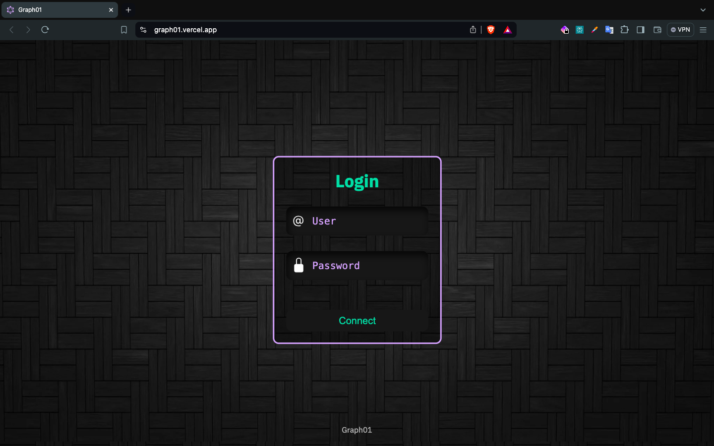
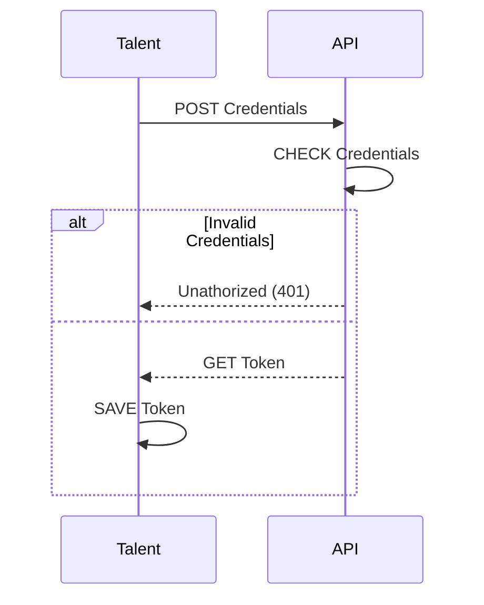
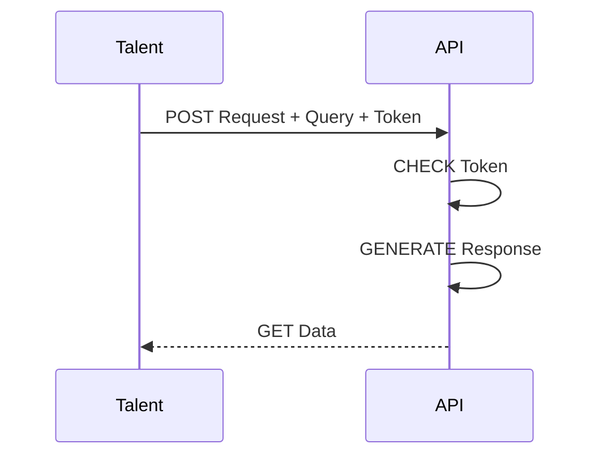
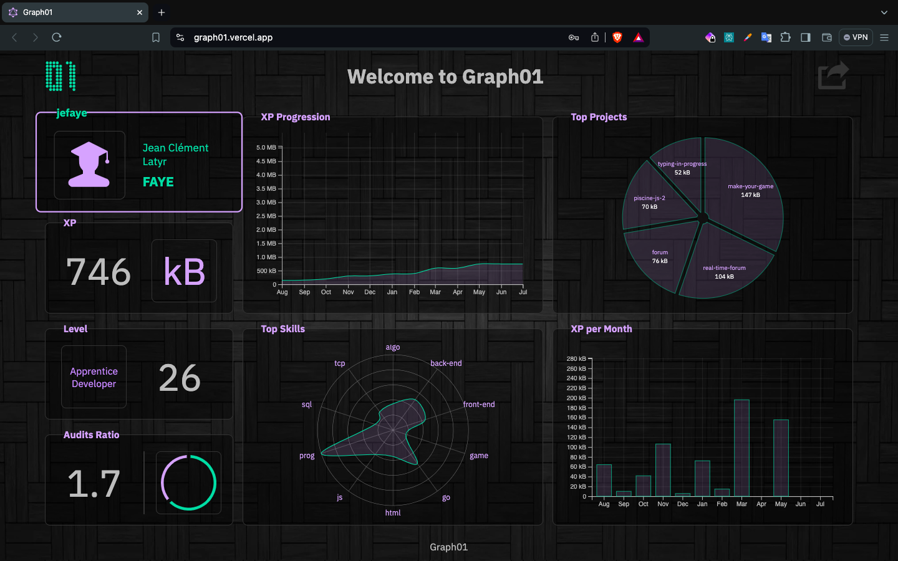

# GraphQL

## Table of Contents

- [**Description**](#description)
- [**Tech Stack**](#tech-stack)
  - [Languages](#languages)
  - [API & Auth](#api--auth)
  - [Development](#development)
  - [OS & Version Control](#os--version-control)
- [**Installation**](#installation)
  - [Cloning](#cloning)
  - [File System](#file-system)
- [**Usage**](#usage)
  - [Login](#login)
  - [Homepage](#homepage)
- [**Aknowledgements**](#aknowledgements)
- [**Sources**](#sources)
- [**License**](#license)

<hr style="background: #333">

## Description 

This project is about creating a Dashboard representing the Statistics of Zone01's talents within the 01-edu System Platform.  
The program should log the **Talent** in the platform to get a **JSON Web Token (JWT)**.  
That token will be used to send subsequent requests with **GraphQL queries** to Get specific Data from the API.  
Finally, the program will graphically represent the Data in the page using **Scalar Vector Graphics (SVG)**.

###### [*Table of Content ⤴️*](#table-of-contents)

<hr style="background: #333">

## Tech Stack

### Languages

Click on badges to get to the code...

[](src/index.html)
[](src/styles/global.css/style.css)
[](src/app.js)

### API & Auth

Click on badges to get to the code...

[](src/graphql/profile.gql.js)
[](src/components/form.js)
[](src/components/charts/radar.js)

### Development

[](https://graph01.vercel.app/)
[]()
[]()
[](./gitify.sh)
[](#table-of-contents)

### OS & Version Control

[]()
[](https://github.com/D4rkJvck/graphql.git)
[]()

###### [*Table of Content ⤴️*](#table-of-contents)

<hr style="background: #333">

## Installation

### Cloning

```bash
$ git clone http://learn.zone01dakar.sn/git/jefaye/graphql
$ cd graphql/
```

### File System

    |
    + -- src/
    |     |
    |     + -- assets/
    |     |     |
    |     |     + -- bg-dark.webp
    |     |
    |     + -- components/
    |     |     |
    |     |     + -- charts/
    |     |     |     |
    |     |     |     + -- area.js
    |     |     |     |
    |     |     |     + -- bar.js
    |     |     |     |
    |     |     |     + -- donut.js
    |     |     |     |
    |     |     |     + -- pie.js
    |     |     |     |
    |     |     |     + -- radar.js
    |     |     |
    |     |     + -- aside.js
    |     |     |
    |     |     + -- form.js
    |     |     |
    |     |     + -- nav.js
    |     |     |
    |     |     + -- section.js
    |     |
    |     + -- graphql/
    |     |     |
    |     |     + -- charts.gql.js
    |     |     |
    |     |     + -- profile.gql.js
    |     |
    |     + -- services/
    |     |     |
    |     |     + -- services.js
    |     |
    |     + -- styles/
    |     |     |
    |     |     + -- components/
    |     |     |     |
    |     |     |     + -- aside.css
    |     |     |     |
    |     |     |     + -- form.css
    |     |     |     |
    |     |     |     + -- nav.css
    |     |     |     |
    |     |     |     + -- section.css
    |     |     |
    |     |     + -- global.css
    |     |     |
    |     |     + -- variables.css
    |     |
    |     + -- templates/
    |     |     |
    |     |     + -- aside.html.js
    |     |     |
    |     |     + -- form.html.js
    |     |     |
    |     |     + -- nav.html.js
    |     |     |
    |     |     + -- section.html.js
    |     |
    |     + -- utils/
    |     |     |
    |     |     + -- elements.js
    |     |     |
    |     |     + -- extract.js
    |     |     |
    |     |     + -- format.js
    |     |
    |     + -- app.js
    |     |
    |     + -- index.html
    |
    + -- .gitignore
    |
    + -- gitify.sh
    |
    + -- LICENSE
    |
    + -- README.md

###### [*Table of Content ⤴️*](#table-of-contents)

<hr style="background: #333">

## Usage

The first step is to get to [Graph01](https://graph01.vercel.app/) in your browser. The address will automatically send to the Login page.

### Login

The login form should be filled with the user GIT pseudo (for ex. jefaye) and the corresponding password. This should send the homepage data suffice it the user is a Talent of the Zone 01 of Dakar.



<!-- REVIEW: Sequence Diagram -->


### Homepage

The fetched data from the Graph queries are then displayed in the Dashboard as such:
  - Profile Section:
    - Git pseudo, Complete Name and Avatar depending on the Gender
    - XP with the amount and suitable unit from conversion depending on the amount
    - Rank Denomination depending on the Level
    - Audit Ratio with a representation of the proportion of received audits and audits done

  - Graph Section:
    - XP Progression in an year interval from the current date
    - Top 5 Projects with the largest amount of XP
    - Top 10 Skills with the highest percentage
    - XP amount per month in a year interval from the current date






###### [*Table of Content ⤴️*](#table-of-contents)

<hr style="background: #333">

## Aknowledgements

[](https://learn.zone01dakar.sn/git/mamoundiaye)
[](https://learn.zone01dakar.sn/git/khthiam)
[](https://learn.zone01dakar.sn/git/cheikhndiaye)  
[](https://learn.zone01dakar.sn/git/mandaw)  
[](https://learn.zone01dakar.sn/git/cnzale)
[](https://learn.zone01dakar.sn/git/adiane)
[](https://learn.zone01dakar.sn/git/mouhamadoufadiop)
[](https://learn.zone01dakar.sn/git/gdiokhan)
[](https://learn.zone01dakar.sn/git/khthiam)

###### [*Table of Content ⤴️*](#table-of-contents)

<hr style="background: #333">

## Sources

[](https://www.youtube.com)  
[](https://gemini.google.com/app)  
[]()  

###### [*Table of Content ⤴️*](#table-of-contents)

<hr style="background: #333">

## License

[](LICENSE)
