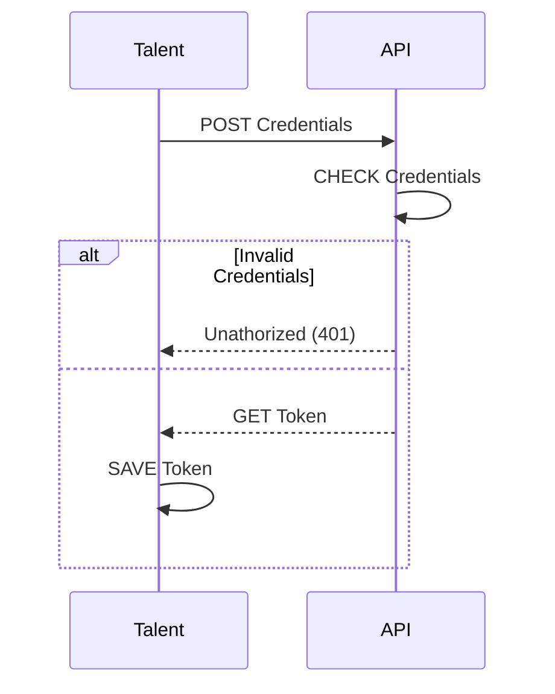
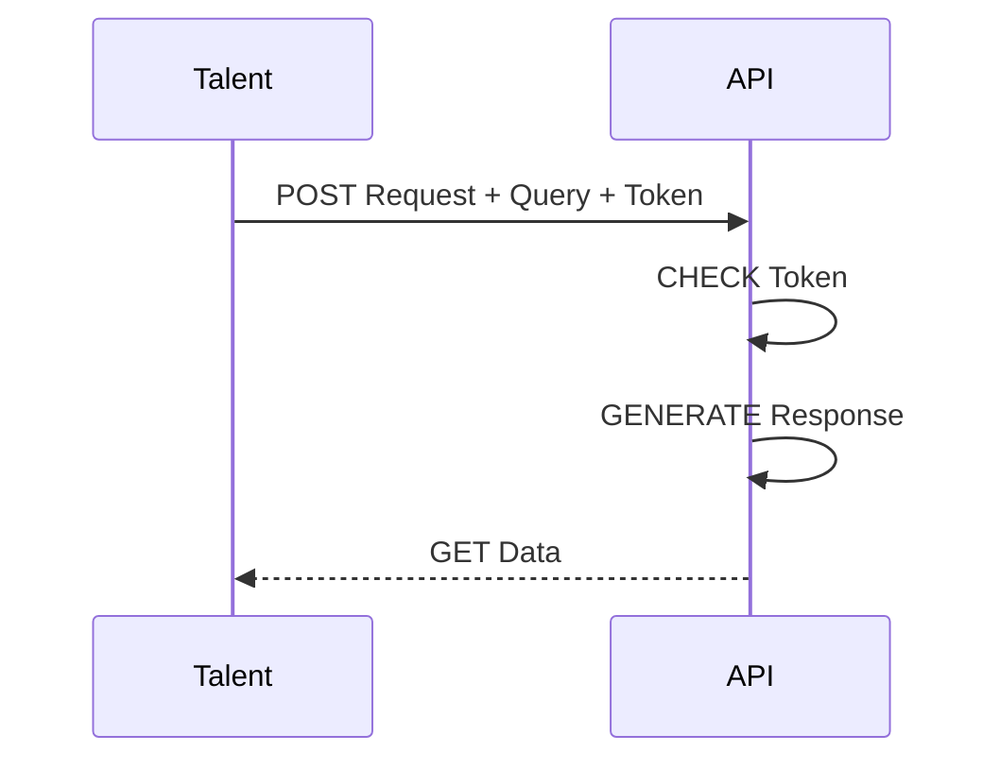

# GraphQL

## Table of Contents

- [**Description**](#description)
- [**Tech Stack**](#tech-stack)
  - [Languages](#languages)
- [**Installation**](#installation)
  - [Cloning](#cloning)
  - [File System](#file-system)
- [**Usage**](#usage)
  - [Login](#login)
- [**Contributing**](#contributing)
- [**Sources**](#sources)
- [**License**](#license)

<hr style="background: #333">

## Description

This project is about creating a Dashboard representing the Statistics of Zone01's talents within the 01-edu System Platform.  
The program should log the **Talent** in the platform to get a **JSON Web Token (JWT)**.  
That token will be used to send subsequent requests with **GraphQL queries** to Get specific Data from the API.  
Finally, the program will graphically represent the Data in the page using **Scalar Vector Graphics (SVG)**.

<hr style="background: #333">

## Tech Stack

### Languages

Click on badges to get to the code...

[](src/index.html)
[](src/styles/global.css/style.css)
[](src/app.js)

### API & Auth

[](src/graphql/)
[](src/components/form.js)

### Development

[]()
[]()
[]()
[]()

### OS and Version Control

[]()
[]()

<hr style="background: #333">

## Installation

### Cloning

```bash
$ git clone http://learn.zone01dakar.sn/git/jefaye/graphql
$ cd graphql/
```

### File System

    |
    + -- src/
    |     |
    |     + -- assets/
    |     |     |
    |     |     + -- bg-dark.webp
    |     |
    |     + -- components/
    |     |     |
    |     |     + -- charts/
    |     |     |     |
    |     |     |     + -- bar.js
    |     |     |
    |     |     + -- aside.js
    |     |     |
    |     |     + -- form.js
    |     |     |
    |     |     + -- nav.js
    |     |     |
    |     |     + -- section.js
    |     |
    |     + -- graphql/
    |     |     |
    |     |     + -- charts.gql.js
    |     |     |
    |     |     + -- profile.gql.js
    |     |
    |     + -- services/
    |     |     |
    |     |     + -- services.js
    |     |
    |     + -- styles/
    |     |     |
    |     |     + -- components/
    |     |     |     |
    |     |     |     + -- aside.css
    |     |     |     |
    |     |     |     + -- form.css
    |     |     |     |
    |     |     |     + -- nav.css
    |     |     |     |
    |     |     |     + -- section.css
    |     |     |
    |     |     + -- global.css
    |     |     |
    |     |     + -- variables.css
    |     |
    |     + -- templates/
    |     |     |
    |     |     + -- aside.html.js
    |     |     |
    |     |     + -- form.html.js
    |     |     |
    |     |     + -- nav.html.js
    |     |     |
    |     |     + -- section.html.js
    |     |
    |     + -- utils/
    |     |     |
    |     |     + -- elements.js
    |     |     |
    |     |     + -- format.js
    |     |
    |     + -- app.js
    |     |
    |     + -- index.html
    |
    + -- .gitignore
    |
    + -- gitify.sh
    |
    + -- LICENSE
    |
    + -- README.md

<hr style="background: #333">

## Usage

### Login
<!-- REVIEW: Sequence Diagram -->


### Homepage



<hr style="background: #333">

## Contributing

<hr style="background: #333">

## Sources

[]()

<hr style="background: #333">

## License

[](LICENSE)
