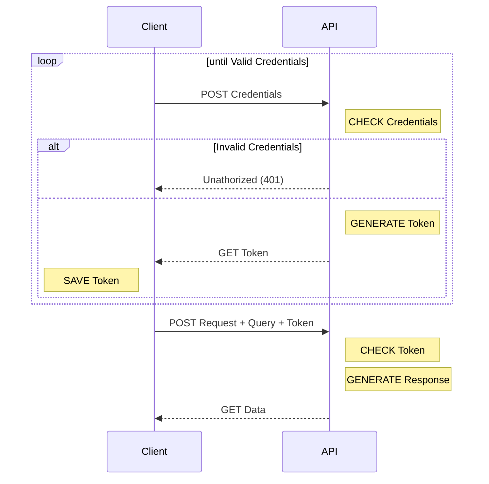

# GraphQL

## Table of Contents

- [**Description**](#description)
- [**Tech Stack**](#tech-stack)
  - [Languages](#languages)
- [**Installation**](#installation)
  - [Cloning](#cloning)
  - [File System](#file-system)
- [**Usage**](#usage)
  - [Login](#login)
- [**Contributing**](#contributing)
- [**Sources**](#sources)
- [**License**](#license)

## Description

## Tech Stack

### Languages

Click on badges to get to the code...

[](index.html)
[](css/style.css)
[](js/app.js)

### API & Auth
[]()
[]()

### Development
[]()
[]()
[]()
[]()

### OS and Version Control
[]()
[]()

## Installation

### Cloning

```bash
$ git clone http://learn.zone01dakar.sn/git/jefaye/graphql
$ cd graphql/
```

### File System

    |
    + -- css/
    |     |
    |     + -- style.css
    |
    + -- img/
    |     |
    |     + -- bg-dark.webp
    |
    + -- js/
    |     |
    |     + -- components/
    |     |     |
    |     |     + -- form-login.js
    |     |     |
    |     |     + -- section-graphs.js
    |     |     |
    |     |     + -- section-profile.js
    |     |
    |     + -- gql/
    |     |      |
    |     |      + -- profile.js
    |     |
    |     + -- svg/
    |     |     |
    |     |     + -- bar-chart.js
    |     |
    |     + -- utils/
    |     |     |
    |     |     + -- elements.js
    |     |     |
    |     |     + -- fetch.js
    |     |
    |     + -- app.js
    |
    + -- git-script.sh
    |
    + -- index.html
    |
    + -- LICENSE
    |
    + -- README.md

## Usage

### Login



## Contributing

## Sources

[]()
[]()

## License

[](LICENSE)
